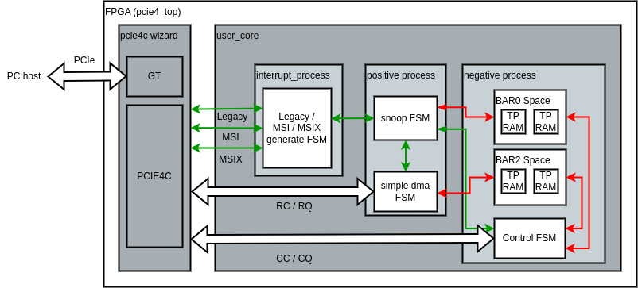
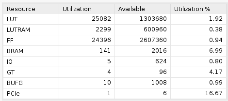

# Simple implementation of PCIE4C-based PCIe transfer on Xilinx Ultrascale+ FPGAs

## Features

* PCIe Memory Read/Write support
* PCIe DMA Read/Write support
* Legacy/MSI/MSI-X interrupt support

## Block Diagram

## Resources Consumption

## Testing

* RTL Design tested on Xilinx Ultrascale+HBM VCU128 FPGA development board.
* Driver tested on RHEL (Red Hat Enterprise Linux) 8.9 with kernel version 4.18.0-477.15.1.el8_8.x86_64

## More Information

[CSDN](https://blog.csdn.net/qq_45434284/article/details/136787997)

